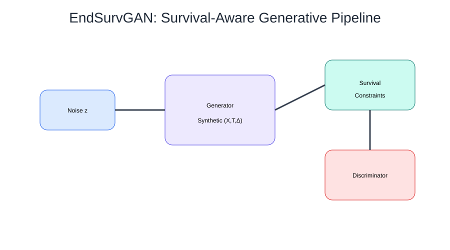

# 🧬 EndSurvGAN

<p align="center">
  
  
  
</p>

<h2 align="center">End-to-End Survival-Aware Generative Modeling of Censored Time-to-Event Data</h2>

<p align="center"><b>Survival Analysis × Generative AI × Statistical Machine Learning</b></p>

---

<p align="center">

</p>

---

## 🌟 Research Vision

EndSurvGAN is a survival-aware generative framework designed to generate realistic synthetic censored time-to-event data while preserving essential survival structures.

Unlike conventional tabular data generators, EndSurvGAN explicitly models:

- Covariate distributions
- Survival-time dynamics
- Event/censoring mechanisms
- Predictor–outcome relationships
- Downstream survival modeling utility

The project aims to support privacy-aware and reproducible healthcare analytics through statistically grounded synthetic survival data generation.

---

## 🎤 Research Recognition

🏆 **Accepted Oral Presentation**  
**18th Iranian Statistics Conference (2026)**

📄 Presentation topic:
**End-to-End Survival-Aware Generative Modeling of Censored Time-to-Event Data**

---

## 🧠 Core Idea

The framework learns the joint survival distribution:

$$P(X,T,\Delta)$$

where:

- **X** → patient-level covariates
- **T** → observed survival time
- **Δ** → event indicator

---

## ⚡ Quick Start

A reproducible workflow:

```text
1. Prepare survival dataset
          ↓
2. Define X, T, Δ representation
          ↓
3. Configure EndSurvGAN parameters
          ↓
4. Train survival-aware generator
          ↓
5. Evaluate synthetic survival data
```

See `QUICKSTART.md` for the project workflow.

---

## 📊 Experimental Evaluation

Benchmark datasets:

| Dataset | Samples | Features |
|---|---:|---:|
| SUPPORT | 9,105 | 14 |
| ACTG | 2,467 | 17 |
| Rotterdam | 2,982 | 7 |

Evaluation framework:

- Kaplan–Meier curve alignment
- Distributional fidelity
- Survival prediction utility
- Concordance Index (C-index)
- Ablation analysis

---

## 📚 Documentation

Research documentation:

- 🏗️ Architecture design
- 🧠 Research notes
- 📖 Related work
- 🎤 Conference presentation
- 🗺️ Research roadmap

Available in the `docs/` directory.

---

## ⚙️ Technical Stack

- Python
- PyTorch
- Deep Neural Networks
- Survival Analysis
- Statistical Machine Learning
- Generative Modeling

---

## 🚀 Future Directions

- Competing-risk survival generation
- Recurrent-event modeling
- Privacy-preserving healthcare AI
- Uncertainty-aware survival modeling

---

## 👩‍🔬 Author

**Zahra Esfandiar**  
Statistics & Data Science Researcher

Research Interests:

🧬 Survival Analysis  
🏥 Biostatistics & Healthcare AI  
📊 Statistical Machine Learning  
🤖 Generative Modeling
